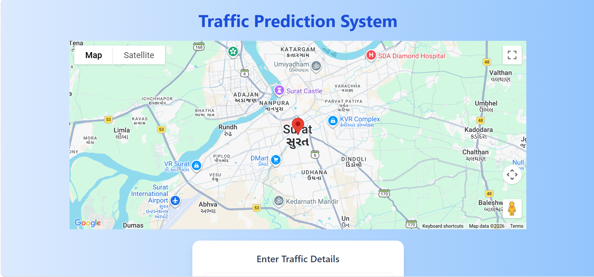
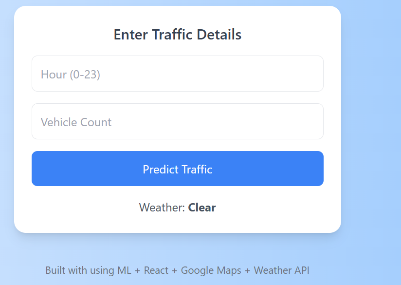
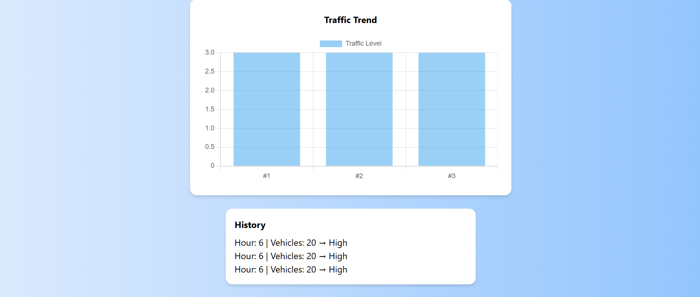

 Real-Time Traffic Prediction System


A full-stack **Machine Learning + Web Application** that predicts traffic congestion levels in real time using a **Random Forest model trained on real-world data**, with live weather integration, interactive maps, and dynamic visualisation.


 **Model Accuracy: ~90%** (Random Forest · Metro Interstate Traffic Volume dataset)

---

 Why This Project

Traffic congestion prediction is a core problem in smart city planning. This project demonstrates how machine learning can be combined with real-time contextual data — weather conditions and time of day — to build an intelligent traffic monitoring system that updates automatically and explains its predictions transparently.

---

 Overview

This project simulates a real-world traffic intelligence system for **Surat, Gujarat**. Users enter the hour and vehicle count; the app automatically fetches live weather, runs a prediction, and visualises results — refreshing every 10 seconds automatically.

---

 Key Features

- Predicts traffic congestion: **Low / Medium / High**
- Random Forest model trained on the [Metro Interstate Traffic Volume dataset](https://archive.ics.uci.edu/ml/datasets/Metro+Interstate+Traffic+Volume)
- Auto-fetches live weather from OpenWeather API (Surat, Gujarat)
- Bar chart showing prediction history trend (Chart.js)
- Interactive Google Maps embed centred on Surat (`21.1702°N, 72.8311°E`)
- Auto-refreshes predictions every **10 seconds** when inputs are filled
- Displays live **model accuracy** with every prediction
- In-session prediction history table
- Responsive UI with Tailwind CSS

---

 Machine Learning Details

| Detail | Value |
|---|---|
| Algorithm | Random Forest Classifier (scikit-learn) |
| Dataset | Metro Interstate Traffic Volume (2012–2018) |
| Training split | 80 / 20 |
| Features | Hour of day, day of week, weather condition (encoded) |
| Target | Low (< 1 000 vehicles/hr) · Medium (1 000 – 2 999) · High (≥ 3 000) |
| Saved artefact | `traffic_model.pkl` — stores both model + accuracy score |

Weather is encoded identically in training and inference:

| Weather string | Code |
|---|---|
| Clear | 0 |
| Clouds | 1 |
| Rain / Drizzle | 2 |
| Snow | 3 |
| Fog / Mist | 4 |

---

 Project Structure

```
traffic-prediction-system/
│
├── backend/
│   ├── app.py             # Flask REST API (/predict endpoint)
│   └── test.py            # API smoke tests
│
├── frontend/
│   ├── src/
│   │   ├── App.js         # Main React UI (maps, chart, history)
│   │   └── App.css        # Custom styles
│   ├── tailwind.config.js
│   └── package.json
│
├── ml-model/
│   ├── train_model.py     # Training script — outputs traffic_model.pkl
│   ├── traffic.csv        # Metro Interstate Traffic Volume dataset
│   └── traffic_model.pkl  # Serialised model + accuracy (generated)
│
├── assets/                # Screenshots
└── README.md
```

---

 Screenshots

| Home & Map | Input Form | Result |
|---|---|---|
|  |  |  | 

---

 Getting Started

Prerequisites

- Python 3.8+
- Node.js 16+
- npm

---

 1 — Clone the repo

```bash
git clone https://github.com/YOUR_USERNAME/traffic-prediction-system.git
cd traffic-prediction-system
```

 2 — Train the model

```bash
cd ml-model
pip install scikit-learn pandas joblib
python train_model.py
# → Saves traffic_model.pkl with model + accuracy
```

 3 — Run the backend

```bash
cd backend
pip install flask flask-cors joblib scikit-learn pandas numpy
python app.py
# → Starts on http://127.0.0.1:5000
```

 4 — Run the frontend

```bash
cd frontend
npm install
npm start
# → Opens http://localhost:3000
```

---

 API Reference

 `POST /predict`

**Request body:**

```json
{
  "hour": 9,
  "vehicle_count": 80,
  "weather": "Rain",
  "day": 2
}
```

> `vehicle_count` is currently collected for future model enhancements and feature expansion. The model uses `hour`, `day`, and `weather` as its active features.

**Response:**

```json
{
  "traffic": "High",
  "accuracy": 0.87
}
```

**Error response (5xx):**

```json
{ "error": "<exception message>" }
```

---

 Example Predictions

| Hour | Weather | Predicted Level |
|------|---------|-----------------|
| 9    | Rain    | High            |
| 14   | Clear   | Low             |
| 18   | Clouds  | High            |

---

 Tech Stack

| Layer | Technology |
|---|---|
| Frontend | React 19, Tailwind CSS, Axios, Chart.js, `@react-google-maps/api` |
| Backend | Python, Flask, Flask-CORS |
| ML | scikit-learn, pandas, NumPy, joblib |
| External APIs | OpenWeather API, Google Maps JavaScript API |

---

 Key Learnings

- Built an end-to-end ML pipeline: data cleaning → feature engineering → training → serialisation → REST API deployment
- Integrated a trained scikit-learn model with a Flask backend and consumed it from a React frontend
- Applied real-world feature engineering (datetime → hour + day-of-week, categorical weather encoding)
- Implemented real-time UI updates with auto-refresh and live Chart.js visualisation
- Worked with a production-scale dataset (48 000+ hourly records, 2012–2018)

---

 Roadmap

- [ ] Add vehicle count as an active model feature
- [ ] Route-based predictions
- [ ] Real-time traffic data integration
- [ ] Advanced analytics dashboard
- [ ] Mobile-responsive PWA
- [ ] Cloud deployment (Render / Railway + Vercel)

---

 Author

**Shruti Mahapatra**

If you found this project helpful, consider giving it a star on GitHub!
