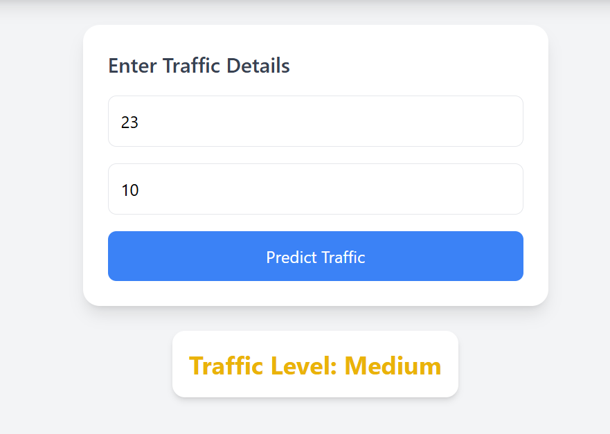

 Real-Time Traffic Prediction System


A production-style full-stack application that predicts traffic congestion using Machine Learning and visualizes results through an interactive map-based interface.

---


 Overview

This project combines **Machine Learning + Web Development + Map Visualization** to simulate a real-world traffic prediction system.

Users can:
- Enter traffic conditions (hour of day & vehicle count)
- View predicted congestion levels — **Low / Medium / High**
- Visualize the monitored location on an interactive Google Map
- Get automatic re-predictions every 10 seconds (real-time simulation)

---

 Key Features

-  Traffic congestion prediction using a **Random Forest Classifier**
-  Auto-refresh predictions every **10 seconds**
-  **Google Maps** integration with a live marker
-  Clean, responsive UI built with **Tailwind CSS**
-  **REST API** powered by Flask
-  Color-coded results — 🟢 Low · 🟡 Medium · 🔴 High

---

 Tech Stack

| Layer | Technologies |
|-------|-------------|
| **Frontend** | React (latest), Tailwind CSS 3, Axios, @react-google-maps/api |
| **Backend** | Flask (Python), Flask-CORS, Joblib |
| **ML Model** | Scikit-learn (RandomForestClassifier), Pandas, NumPy |

---

 Project Structure

```
traffic-prediction-system/
│
├── backend/
│   ├── app.py                  # Flask REST API (/predict endpoint)
│   └── test.py                 # Backend unit tests
│
├── frontend/
│   ├── public/
│   │   └── index.html
│   ├── src/
│   │   ├── App.js              # Main React component
│   │   ├── App.css
│   │   └── index.js
│   ├── package.json
│   ├── tailwind.config.js
│   └── postcss.config.js
│
├── ml-model/
│   ├── train_model.py          # Model training script
│   └── traffic_model.pkl       # Pre-trained Random Forest model
│
├── README.md
└── .gitignore
```

---

 Getting Started

 Prerequisites

- Python 3.8+
- Node.js 16+ and npm
- A [Google Maps API key](https://developers.google.com/maps/documentation/javascript/get-api-key)

---

 1. Clone the Repository

```bash
git clone https://github.com/YOUR_USERNAME/traffic-prediction-system.git
cd traffic-prediction-system
```

---

 2. Train the Model (Optional)

A pre-trained `traffic_model.pkl` is already included. To retrain:

```bash
cd ml-model
pip install scikit-learn pandas joblib
python train_model.py
# Output: "Model trained and saved!"
```

> Copy the new `traffic_model.pkl` to the `ml-model/` folder if you retrain.

---

3. Run the Backend

```bash
cd backend
pip install flask flask-cors joblib scikit-learn
python app.py
```

The Flask server will start at `http://127.0.0.1:5000`.

**API Endpoint:**
```
POST /predict
Content-Type: application/json

{ "hour": 9, "vehicle_count": 80 }
→ { "traffic": "High" }
```

---

 4. Run the Frontend

```bash
cd frontend
npm install
npm start
```

The React app will open at `http://localhost:3000`.

> **Note:** Add your Google Maps API key in `src/App.js` at the `googleMapsApiKey` prop in `<LoadScript>`.
> ⚠️ Never expose your API key publicly. Use a `.env` file:
> ```
> REACT_APP_GOOGLE_MAPS_KEY=your_key_here
> ```
> Then reference it as `process.env.REACT_APP_GOOGLE_MAPS_KEY` in `App.js`.

---

 Example Predictions

| Hour | Vehicle Count | Predicted Level |
|------|---------------|-----------------|
| 8    | 50            | Medium          |
| 9    | 80            | High            |
| 14   | 30            | Low             |
| 17   | 100           | High            |
| 23   | 10            | Low             |

---

 How the ML Model Works

1. **Input features:** `hour` (0–23) and `vehicle_count`
2. **Algorithm:** `RandomForestClassifier` from scikit-learn
3. **Labels:** `Low (0)`, `Medium (1)`, `High (2)`
4. **Training data:** Located in `train_model.py` — can be replaced with a real dataset
5. **Serialization:** Model saved as `traffic_model.pkl` using `joblib`

The map is centered on **Surat, Gujarat, India** (lat: 21.1702, lng: 72.8311) by default.

---

 Screenshots

 Home Page


 Input Section


Prediction Result


> To add screenshots: create an `assets/` folder in the repo root and drop in your images.

---

 Future Improvements

- [ ] Route-based traffic prediction (origin → destination)
- [ ] Weather data integration for richer predictions
- [ ] Live traffic API (e.g., Google Maps Traffic Layer, TomTom)
- [ ] Historical trend charts
- [ ] Mobile app version (React Native)
- [ ] Docker containerization for easier deployment

---

 Requirements

**Backend (`pip install`):**
```
flask
flask-cors
joblib
scikit-learn
pandas
numpy
```

**Frontend (`npm install`):**
```
react (latest)
axios
@react-google-maps/api
tailwindcss
```

---

 Author

**Shruti Mahapatra**

---

 License

This project is open-source and available under the [MIT License](LICENSE).
